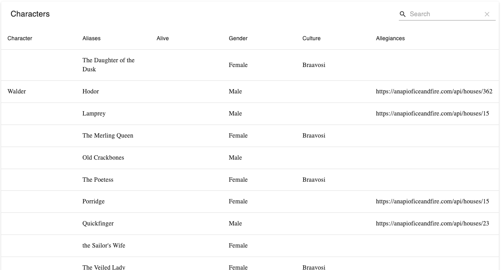
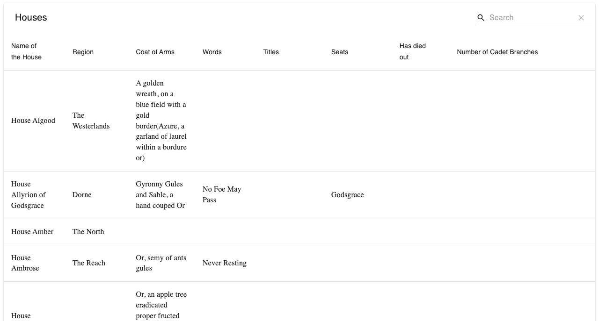

React Dev - GoT API app

Te main purpose of the project is creating a simple React application 
with use of an API of Ice And Fire, as an endpoint to display the paginated list of products.

## Table of Contents

* [General Info](#general-information)
* [Technologies Used](#technologies-used)
* [Screenshots](#screenshots)
* [Setup](#setup)
* [Project Status](#project-status)
* [Room for Improvement](#room-for-improvement)
* [Contact](#contact)

## General Information

- Application should display 2 data types: characters and houses.
- As an entry point application should use characters page with the link to house page and backwards to characters page.
- Table of Characters should display 5 columns with content of (character name, gender, culture, allegiances, status whether is alive or dead).
- Table of Houses should display 9 columns with content of (name of the House, region, coat of Arms, words, titles, seats, has died out, has overlord, number of Cadet Branches)
- The table should display 25 items per page. Under the table, there should be a pagination component, which allows switching between pages with “next” and “previous” arrows.
- It should be possible to filter the list of Characters returned from API by Gender.
  Use select or dropdown with “Any”, "Male" and "Female" as options.
  It should be possible to filter the list of Characters returned from API by Culture.
  Use text input.
- Allegiances
  Display list of House id fields based on what is found in allegiances field.
  Link each House displayed to a dedicated page with House details.
  Display “No allegiances” when not available.
- Alive
  Based on born and died fields:
  --Display "Unknown” if both born and died are not provided. 
  --Display "No” if born is not provided.
  --Display "No, died at X years old" when Character has died, where X is his age in years at the time
  of death.
  --Display "Yes" when Character has not died.
## Technologies Used

- React
- React-Router
- Material UI - Material-table
- React Hooks (useState, useEffect)

## Screenshots

## Setup

- download or clone repository / `git clone repo_address`
- install dependencies / `npm install`
- start app by `npm start`

## Project Status

Project is: _in progress_.

Until now, I've managed to create React app that displays Table of Characters data as an entry point, to reach the Table of House content it is necessary to entry http://localhost:3000/houses path.
As a default table displaying 25 results per page. Application user can select or dropdown with 10, 25 and 50 as options.
Table allows user to filter Genders of the Characters as well as search input allows to find individual phrases.

## Room for Improvement

- Alive column implementation based on born and died fields.
- Allegiances with displaying list of House id fields based on what is found in allegiances field with the links to house details page.
- From the Table of Characters link each House displayed to a dedicated page with the House Details.
  From the House Details page it should be possible to go back to the Table of Characters page.
- 
## Contact

Created by [_Duckjaniels_](https://www.linkedin.com/in/maksym-kaczorowski-008b3a154/) - feel free to contact me!